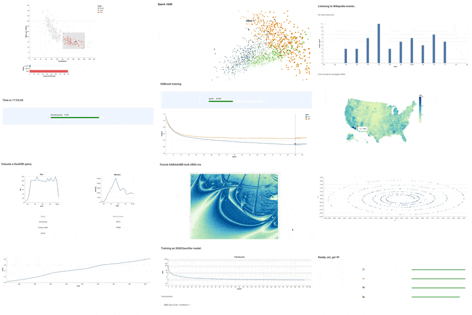

# Gallery of Metaflow Dynamic Cards

Imagine a long-running task, like training of an ML/AI model, a data processing task,
or a task communicating with an external service. In all these cases, it is useful to
know how the task is performing and how/if it is making progress while it is running.

Metaflow allows you to [orchestrate even large compute tasks](https://docs.metaflow.org/scaling/introduction)
easily, which you can then [monitor live using dynamic cards](https://docs.metaflow.org/metaflow/visualizing-results).
This repository contains a gallery of dynamic cards, showing how you can apply them in various use cases.

## Starter Examples

 - [Basic Chart](basic-chart) - This is an example of this and that
 - [Basic Chart](basic-chart) - This is an example of this and that

## Monitoring Work

| Example  | Description |
| ------------- | ------------- |
| [Basic Chart](basic-chart)  |   |
| Content Cell  | Content Cell  |

## Advanced Examples

| Example  | Description |
| ------------- | ------------- |
| [Basic Chart](basic-chart)  |   |
| Content Cell  | Content Cell  |
