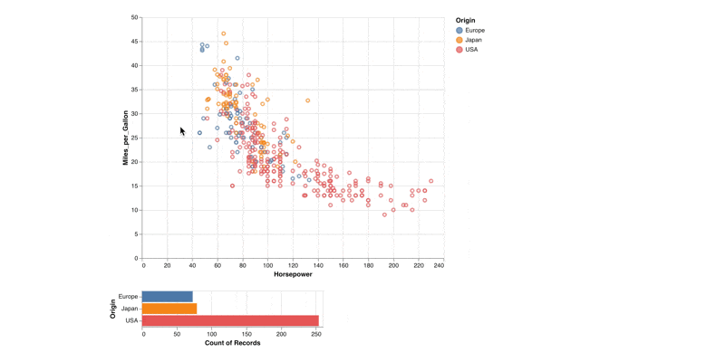

A Metaflow Dynamic Card Example
# Basic Chart using Altair



This example shows how to create a basic interactive chart
using the [Altair](https://altair-viz.github.io/) library. This
chart doesn't update while the task is executing.

See [Visualizing results](https://docs.metaflow.org/metaflow/visualizing-results) in Metaflow docs for more information.

## Usage

Start a local card server in a terminal (or use your existing Metaflow UI):
```
python altairflow.py --environment=pypi card server
```
In another terminal, execute the flow
```
python altairflow.py --environment=pypi run
```
