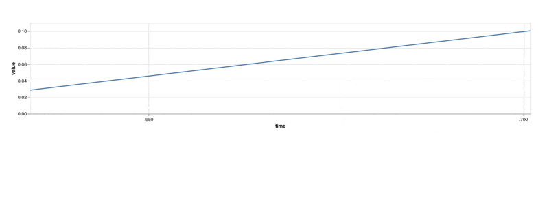

A Metaflow Dynamic Card Example
# Basic Chart using Altair



This example shows how to create a basic updating line chart
using a [Vega Lite](https://vega.github.io/vega-lite/) specification. Notably,
this example doesn't require any external dependencies. The chart updates
every few seconds.

See [Visualizing results](https://docs.metaflow.org/metaflow/visualizing-results) in Metaflow docs for more information.

## Usage

Start a local card server in a terminal (or use your existing Metaflow UI):
```
python simplechart.py card server --poll-interval 1
```
In another terminal, execute the flow
```
python simplechart.py run
```
