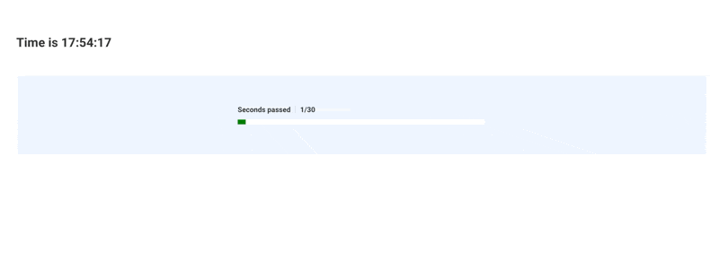

A Metaflow Dynamic Card Example
# Basic Progress Bar



This example shows how to create a basic progress bar that
updates while a task is executing.

See [Visualizing results](https://docs.metaflow.org/metaflow/visualizing-results) in Metaflow docs for more information.

## Usage

Start a local card server in a terminal (or use your existing Metaflow UI):
```
python clockflow.py card server --poll-interval 1
```
Execute the flow in another terminal:
```
python clockflow.py run
```
