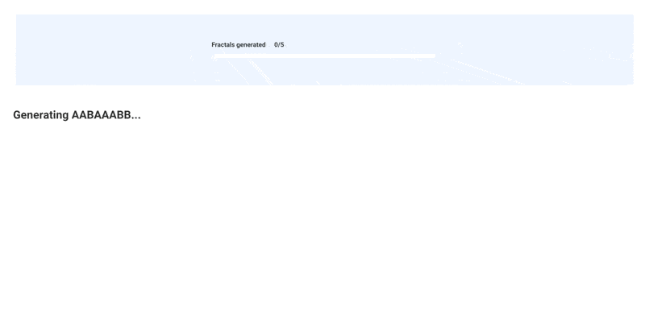

A Metaflow Dynamic Card Example
# Add Components In a Card On the Fly



This example shows how to add new components, in this case images, in a card
on the fly as more results are produced by a task.

See [Visualizing results](https://docs.metaflow.org/metaflow/visualizing-results) in Metaflow docs for more information.

## Usage

Start a local card server in a terminal (or use your existing Metaflow UI):
```
python fractalflow.py --environment=pypi card server --poll-interval 1
```
Execute the flow in another terminal:
```
python fractalflow.py --environment=pypi run
```
