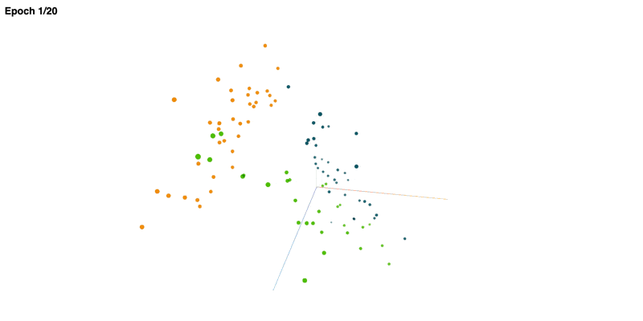

A Metaflow Dynamic Card Example
# Custom Card



This is an advanced example that shows how you can use a fully custom card
that leverages external Javascript libraries. To learn how to create a custom
card of your own, take a look at [the `metaflow-card-scatter3d` repository](https://github.com/outerbounds/metaflow-card-scatter3d)
used in this example.

The `scatter3d` custom card shows an interactive 3D scatter plot, powered by
[Google's `scatter-gl` library](https://github.com/PAIR-code/scatter-gl/).
Here, we generate a dummy 3D test dataset, but you can use `scatter3d` to visualize any 3D or 2D data of your own.

See [Visualizing results](https://docs.metaflow.org/metaflow/visualizing-results) in Metaflow docs for more information.

## Usage

First, install the custom card extension
```
pip install metaflow-card-scatter3d
```
You need to do this only once. Notably, Metaflow packages the extension for remote execution automatically, so you just need to install it on the workstation you use for development.

Start a local card server in a terminal (or use your existing Metaflow UI):
```
python scatterflow.py card server
```
In another terminal, execute the flow
```
python scatterflow.py --environment=pypi run
```
