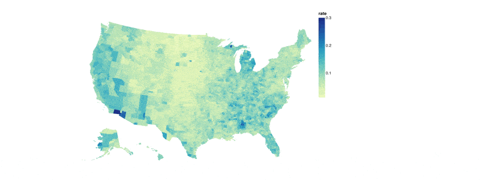

A Metaflow Dynamic Card Example
# Map Chart



This example shows how to create an interactive map chart. The chart specification is
derived from [this Vega Lite example](https://altair-viz.github.io/gallery/choropleth.html).
The data in this chart doesn't update dynamically. Notably no external dependencies
are required to create a chart like this.

See [Visualizing results](https://docs.metaflow.org/metaflow/visualizing-results) in Metaflow docs for more information.

## Usage

Start a local card server in a terminal (or use your existing Metaflow UI):
```
python mapchart.py card server
```
Execute the flow in another terminal:
```
python mapchart.py run
```
