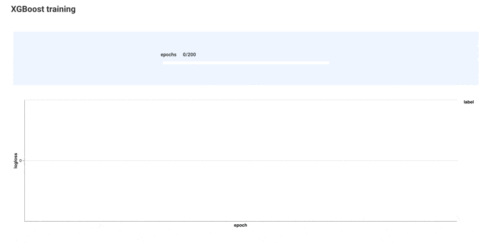

A Metaflow Dynamic Card Example
# Monitor Results Using a Callback



This example shows how to use a custom callback, which are offered by
many libraries, to monitor progress. Here, we demonstrate the pattern
using [XGBoost's custom callbacks](https://xgboost.readthedocs.io/en/stable/python/callbacks.html#defining-your-own-callback)
but the same principle applies to many other libraries as well.

Notably, this example is rather practical by itself: It allows you to monitor
loss curves of XGBoost training. The chart is interactive, so you can observe
metrics in detail.

See [Visualizing results](https://docs.metaflow.org/metaflow/visualizing-results) in Metaflow docs for more information.

## Usage

Start a local card server in a terminal (or use your existing Metaflow UI):
```
python monitor_xgboost.py --environment=pypi card server --poll-interval 1
```
Execute the flow in another terminal:
```
python monitor_xgboost.py --environment=pypi run
```
