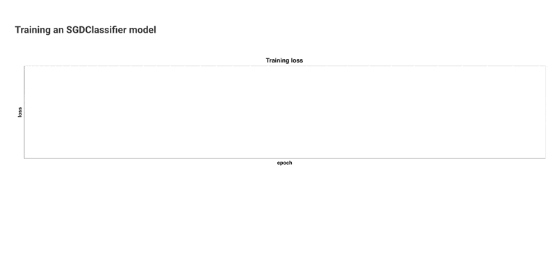

A Metaflow Dynamic Card Example
# Monitor Results Using a Callback



This example shows a very useful and common pattern: Launching a subprocess
to perform work in parallel to the main flow that monitors progress.
Doing this is easier than it sounds using [`multiprocess.Pool`](https://docs.python.org/3/library/multiprocessing.html#module-multiprocessing.pool).

Notably, this pattern works with any library or external process, which don't have to be written in Python even, as this approach
doesn't require any cooperation from the worker process. We demonstrate this with [SciKit Learn](https://scikit-learn.org/) which
notoriously [lacks explicit support for monitoring progress](https://github.com/scikit-learn/scikit-learn/issues/24524).

We capture the output of the subprocess in a file, which ensures that the worker process is decoupled from the parent. Periodically,
the parent reads and parses the logs and visualizes the progress in a chart.

See [Visualizing results](https://docs.metaflow.org/metaflow/visualizing-results) in Metaflow docs for more information.

## Usage

Start a local card server in a terminal (or use your existing Metaflow UI):
```
python monitor_sklearn.py --environment=pypi card server --poll-interval 1
```
Execute the flow in another terminal:
```
python monitor_sklearn.py --environment=pypi run
```
