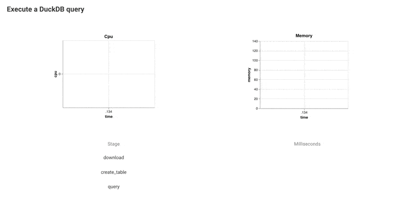

A Metaflow Dynamic Card Example
# Monitor a Thread



This example shows a useful and common pattern: Monitoring work performed
by a separate worker thread.

You may have heard of Python's infamous [Global Interpreter Lock](https://realpython.com/python-gil/),
which limits Python's ability to execute Python code in parallel. However, this limitation doesn't
apply to many external libraries that are written in C and other low-level languages, which are
ubiquitous in the world of data, ML, and AI.

We demonstrate the pattern by launching a worker thread that processes a decent-sized dataset using
[DuckDB](https://duckdb.org). The main flow monitors performance of the thread by recording CPU and
memory consumed, as well as the stage of the work performed. We do this using
[the `psutil` library](https://psutil.readthedocs.io/en/latest/) which comes in handy whenever you
need to monitor system-level metrics.

Note that **it is not safe to call `current.card` operations in other threads**. Instead, you can
perform work in other threads and call `current.card` in the main step code, as shown in this example.
If you are not sure how your code behaves in a thread, consider using [the subprocess approach](https://github.com/outerbounds/dynamic-card-examples/tree/main/monitor-subprocess) which works universally with any code.

See [Visualizing results](https://docs.metaflow.org/metaflow/visualizing-results) in Metaflow docs for more information.

## Usage

Start a local card server in a terminal (or use your existing Metaflow UI):
```
python monitor_duckdb.py --environment=pypi card server --poll-interval 1
```
Execute the flow in another terminal:
```
python monitor_duckdb.py --environment=pypi run
```
