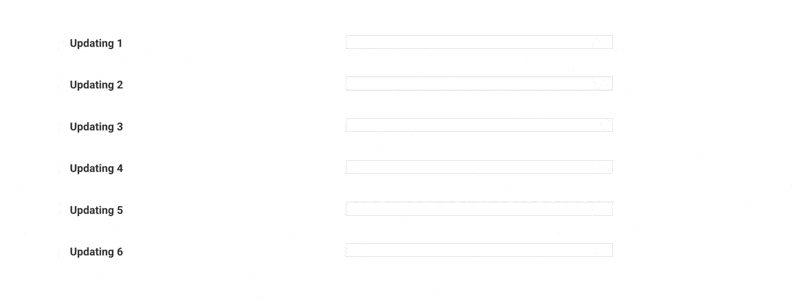

A Metaflow Dynamic Card Example
# Custom Progress Bars with Vega Lite



This example shows how you can use Vega Lite to to create custom charts:
In this case, sparklines that work as progress bars. See [the extensive
documentation of Vega Lite](https://vega.github.io/vega-lite/examples/)
for details about the specification.

Note how the state of each chart is encapsulated in a `RandomSpark` class: This
pattern can come in handy when you create more complex updating visualizations.

This example doesn't require any external dependencies. The chart updates
every few seconds.

See [Visualizing results](https://docs.metaflow.org/metaflow/visualizing-results) in Metaflow docs for more information.

## Usage

Start a local card server in a terminal (or use your existing Metaflow UI):
```
python sparklines.py card server --poll-interval 1
```
Execute the flow in another terminal:
```
python sparklines.py run
```
