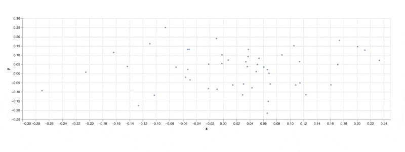

A Metaflow Dynamic Card Example
# Updating Altair Chart



This example shows how to update data in a chart created
using the [Altair](https://altair-viz.github.io/) library on the fly.

See [Visualizing results](https://docs.metaflow.org/metaflow/visualizing-results) in Metaflow docs for more information.

## Usage

Start a local card server in a terminal (or use your existing Metaflow UI):
```
python updating_altair.py --environment=pypi card server --poll-interval 1
```
Execute the flow in another terminal:
```
python updating_altair.py --environment=pypi run
```
